# Architecture de la base de données — Fiches Métiers

Proposition de modèle relationnel (MariaDB / MySQL 8) dérivé des deux classeurs sources.

Le principe directeur : **les classeurs sont « à plat »** (`COND_1`…`COND_15`, `FORMACODE_1`…`FORMACODE_5`,
`APPELL_METIER_1`…`APPELL_METIER_10`). Recopier ces colonnes en SQL donnerait des tables à 65 colonnes
impossibles à requêter. On les **normalise en tables de liaison** : une ligne par valeur, avec un `ordre`
pour conserver la position d'origine dans le tableur.

---

## 1. Ce que contiennent réellement les fichiers

### `Base formacodes_DC structurants.xlsx`
1 feuille, 471 lignes de données.

| Colonne | Devient |
|---|---|
| `NSF` | `nsf.code_nsf` |
| `Formacode` | `formacode.code_formacode` |
| `INTITULE` | `formacode.intitule` |
| `Niveau d'approfondissement` | `formacode_niveau.niveau` |
| `Durée mois` / `Durée réelle en semaines` / `Durée réelle en heures` | `formacode_niveau.duree_*` |
| `Méthode de calcul` | `formacode_niveau.methode_calcul` |
| `Source` | `formacode_niveau.source` |

> 173 formacodes distincts, 43 NSF. Le niveau est parfois textuel (`« Niveau unique (3) »`) →
> à normaliser en entier + drapeau `est_niveau_unique` à l'import.

### `251230_base competences_V3.3.xlsm`
24 feuilles, dont **4 seulement portent des données sources** — le reste est de l'interface Excel
ou du calcul dérivé.

| Feuille | Lignes | Nature | Destination |
|---|---|---|---|
| `Outil_collecte_fiche_metier` | 333 fiches (439 col.) | **source des fiches métier** | `metier` + 5 tables de liaison |
| ~~`data_METIERS`~~ | 333 (61 col.) | **non importée** | projection appauvrie — voir §1 bis |
| `data_METIERS_ACT` | 333 (8 col.) | **source** | `metier_activite` |
| `data_ACT_COMP_CONN` | 1 360 activités (65 col.) | **source** | `activite` + 5 tables de liaison |
| `Formacode_niveau` | 158 formacodes (12 col.) | **source** | `formacode` / `formacode_niveau` |
| `nomencl_FAMMETIERS` | 17 familles | référentiel | `famille_metier` |
| `nomencl_FAMACTIVITES` | 49 familles | référentiel | `famille_activite` |
| `nomencl_COND` | 15 critères | référentiel | `critere_condition` |
| `nomencl_TRANSV` | 17 compétences | référentiel | `competence_transversale` |
| `nomencl_ACCES` | 7 critères | référentiel | `critere_acces` |
| `Degre_Elargissement` | 333 × 333 | **calculé** | `metier_proximite.degre_elargissement` |
| `Table_durée_différence_métier` | 333 × 333 | **calculé** | `metier_proximite.duree_acquisition_heures` |
| `Table_durée_différence_DC` | 158 × 333 | **calculé** | `metier_connaissance_ecart` |
| `Table_Niveau_différence_DC` | 158 × 333 | **calculé** | `metier_connaissance_ecart.ecart_niveau` |
| `Notice`, `fiche métier`, `Liste`, `Liste métiers proches`, `Passerelle…`, `Mise à jour données`, `result_CONN`, `Enregistrer une fiche métier`, `RequÊte Couple Activité-Comp` | — | **UI / VBA Excel** | non importées (ce sont les écrans que le front remplace) |

**Les 4 matrices calculées ne sont pas des données** : ce sont les résultats des formules Excel.
En base elles deviennent des tables **matérialisées** recalculées par un job (voir §5), pas des
tables saisies.

---

## 1 bis. Pourquoi `Outil_collecte_fiche_metier` et jamais `data_METIERS`

`Outil_collecte_fiche_metier` est le **formulaire de collecte brut** : 439 colonnes, un métier
entier par ligne (identité, 6 blocs activité-compétence, 17 transversales, jusqu'à 30 domaines
de connaissance, métadonnées de saisie). `data_METIERS` en est une **projection** : elle
reprend l'identité du métier mais perd tout le reste.

Ce que `data_METIERS` ne contient pas :

| Information | `Outil_collecte` | `data_METIERS` |
|---|---|---|
| Libellé complet de la famille (`D - Production de biens industriels`) | 333/333 | absent (seule la lettre, déduite du code) |
| `DOSSIER_Autre` — dossier saisi en clair | 106/333 | absent |
| `NB_COUPLE` — nb de couples déclarés | 299/333 | absent |
| Remarque libre du rédacteur | 11/333 | absent |
| Traçabilité (`CLE`, dates, durée, appareil de saisie) | 299/333 | absent |
| Contenu des activités et compétences | inline | renvoyé vers d'autres feuilles |

Sur les champs communs, en revanche, **les deux feuilles sont également remplies** — vérifié
colonne par colonne sur les 332 codes partagés (`DEF_METIER` 332/332 des deux côtés,
`APPELL_1` 326/332, `ROME_1` 330/332, etc.). `data_METIERS` n'est donc pas incomplète *sur ce
qu'elle contient* : elle est incomplète *par ce qu'elle omet*.

**Décision : `data_METIERS` n'est utilisée pour rien, pas même en appoint.** Trois conséquences
à connaître, mesurées et non supposées :

1. **`MOYENNE_NIV_FORMATION` est abandonnée.** Donnée calculée qui n'existe que dans
   `data_METIERS`. N'ayant plus aucune source, la colonne a été supprimée (migration 003)
   plutôt que laissée éternellement `NULL` : une colonne qui ne peut jamais être renseignée
   laisse croire à une donnée manquante alors qu'elle est inexistante.
2. **Un métier est mal codé dans `Outil_collecte`, et rien ne permet de trancher.** Le code
   `D314` y apparaît deux fois : ligne 314 « Responsable de production »
   (*OCAPIAT_Industrie de la viande*) et ligne 315 « Responsable d'atelier de production »
   (*5 branches*). Ce sont bien deux métiers distincts, mais un seul code pour les deux.
   `data_METIERS` donnait la réponse (`D313` pour le premier) — cette source étant écartée,
   **la correction doit être faite dans le classeur**. En attendant, l'import consigne la
   collision et ignore la seconde ligne : 332 métiers importés au lieu de 333, visiblement
   plutôt que silencieusement.
3. **Les intitulés sont conservés en casse de saisie** (`AGENT DE SILO`, `Chauffeur(se)
   Livreur(se)`). Aucune normalisation à l'import : le front affiche ce que le rédacteur a
   saisi. 71 intitulés sont dans ce cas.

---

## 2. Référentiels (nomenclatures)

```sql
CREATE TABLE nsf (
  code_nsf      VARCHAR(10)  PRIMARY KEY,   -- '221', '311', '114'
  libelle       VARCHAR(255)
);

CREATE TABLE formacode (
  code_formacode  VARCHAR(10) PRIMARY KEY,  -- '21547'
  intitule        VARCHAR(255) NOT NULL,
  code_nsf        VARCHAR(10) NULL REFERENCES nsf(code_nsf),
  est_fondamental BOOLEAN NOT NULL DEFAULT FALSE
);

-- Durée d'acquisition d'un formacode à un niveau d'approfondissement donné.
-- Fusionne le fichier 1 et la feuille Formacode_niveau.
CREATE TABLE formacode_niveau (
  id                 INT AUTO_INCREMENT PRIMARY KEY,
  code_formacode     VARCHAR(10) NOT NULL REFERENCES formacode(code_formacode),
  niveau             TINYINT NOT NULL,          -- 1..4
  est_niveau_unique  BOOLEAN NOT NULL DEFAULT FALSE,
  duree_heures       DECIMAL(10,2) NULL,
  duree_semaines     DECIMAL(10,2) NULL,
  duree_mois         DECIMAL(10,2) NULL,
  methode_calcul     TEXT NULL,
  source             TEXT NULL,
  origine            ENUM('base_formacodes','base_competences') NOT NULL,
  UNIQUE KEY uk_formacode_niveau (code_formacode, niveau, origine)
);
```

> `origine` dans la clé unique : les deux classeurs se recouvrent (173 vs 158 formacodes) et
> peuvent diverger sur la durée. On garde les deux versions plutôt que d'en écraser une
> silencieusement, et le front choisit laquelle fait foi.

```sql
CREATE TABLE famille_metier (
  code_famille  VARCHAR(5) PRIMARY KEY,      -- 'A'..'Q'
  intitule      VARCHAR(255) NOT NULL,       -- 'A Conception, études, R&D et Innovation'
  definition    TEXT NULL
);

CREATE TABLE famille_activite (
  code_famille_activite VARCHAR(10) PRIMARY KEY,  -- 'A.01', 'B.02'
  domaine_1             VARCHAR(255),             -- INT_DOM_1_ACT
  domaine_2             VARCHAR(255),             -- INT_DOM_2_ACT
  domaine_3             TEXT,                     -- INT_DOM_3_ACT (définition longue)
  exemple_competence    TEXT NULL
);

CREATE TABLE critere_condition (      -- nomencl_COND : COND_1..COND_15
  code_condition VARCHAR(10) PRIMARY KEY,
  libelle        VARCHAR(255) NOT NULL,  -- 'Travail en extérieur'
  ordre          TINYINT NOT NULL
);

CREATE TABLE competence_transversale (  -- nomencl_TRANSV : TRANSV_1..TRANSV_17
  code_transversale VARCHAR(10) PRIMARY KEY,
  libelle           VARCHAR(255) NOT NULL,  -- 'Analyse et synthèse de l'information'
  palier_1          TEXT, palier_2 TEXT, palier_3 TEXT, palier_4 TEXT,
  ordre             TINYINT NOT NULL
);

CREATE TABLE critere_acces (          -- nomencl_ACCES : ACCES_1..ACCES_7
  code_acces VARCHAR(10) PRIMARY KEY,
  libelle    VARCHAR(255) NOT NULL,
  ordre      TINYINT NOT NULL
);

CREATE TABLE dossier_source (         -- 7 valeurs : OCAPIAT, INTERGROS, FNAM, AKTO...
  id      INT AUTO_INCREMENT PRIMARY KEY,
  libelle VARCHAR(255) NOT NULL UNIQUE,
  opco    VARCHAR(50) NULL,
  annee   SMALLINT NULL
);

CREATE TABLE mot_cle (
  id      INT AUTO_INCREMENT PRIMARY KEY,
  libelle VARCHAR(150) NOT NULL UNIQUE
);
```

---

## 3. Noyau métier

```sql
CREATE TABLE metier (                 -- Outil_collecte_fiche_metier, 333 lignes
  code_metier              VARCHAR(10) PRIMARY KEY,   -- 'D1', 'C2', 'P143'
  n_obs                    INT NULL,                    -- N°Obs, ordre de collecte
  intitule                 VARCHAR(255) NOT NULL,       -- INT_METIER
  definition               TEXT,                        -- DEF_METIER
  code_famille             VARCHAR(5) NULL REFERENCES famille_metier(code_famille),
  dossier_source_id        INT NULL REFERENCES dossier_source(id),
  dossier_autre            VARCHAR(255) NULL,           -- DOSSIER_Autre
  respons_transverse       ENUM('oui','non') NULL,      -- RESPONS_TRANSV
  interface_amont_aval     VARCHAR(255) NULL,           -- INTERFACE
  redacteur                VARCHAR(100) NULL,           -- Nom_redacteur
  nb_couple                TINYINT NULL,                -- NB_COUPLE
  remarque                 TEXT NULL,                   -- remarque libre de fin de questionnaire

  -- Traçabilité de la collecte. NULL pour les 34 fiches hors outil (voir §1 bis).
  cle_collecte             VARCHAR(20) NULL,            -- CLE
  date_saisie              DATETIME NULL,
  date_enregistrement      DATETIME NULL,
  date_modification        DATETIME NULL,
  temps_saisie             DECIMAL(12,4) NULL,          -- en secondes
  origine_saisie           VARCHAR(50) NULL,
  langue_saisie            VARCHAR(10) NULL,
  appareil_saisie          VARCHAR(50) NULL,

  created_at TIMESTAMP DEFAULT CURRENT_TIMESTAMP,
  updated_at TIMESTAMP DEFAULT CURRENT_TIMESTAMP ON UPDATE CURRENT_TIMESTAMP,
  KEY idx_metier_cle_collecte (cle_collecte),
  FULLTEXT KEY ft_metier (intitule, definition)
);
```

> Le formulaire de collecte porte le libellé complet de la famille en colonne 41
> (`D - Production de biens industriels`) : c'est de là que `famille_metier` est alimentée,
> et non d'une déduction sur la première lettre du code.

> `code_famille` se déduit du préfixe alphabétique de `code_metier` (`D19` → `D`), mais on le
> stocke explicitement : la règle peut changer et une jointure sur `LEFT(code, 1)` est non indexable.

```sql
CREATE TABLE metier_appellation (     -- APPELL_METIER_1..10
  id          INT AUTO_INCREMENT PRIMARY KEY,
  code_metier VARCHAR(10) NOT NULL REFERENCES metier(code_metier) ON DELETE CASCADE,
  appellation VARCHAR(255) NOT NULL,
  ordre       TINYINT NOT NULL,
  UNIQUE KEY uk_appellation (code_metier, ordre),
  KEY idx_appellation_libelle (appellation)
);

CREATE TABLE metier_rome (            -- ROME_1..3
  id          INT AUTO_INCREMENT PRIMARY KEY,
  code_metier VARCHAR(10) NOT NULL REFERENCES metier(code_metier) ON DELETE CASCADE,
  code_rome   VARCHAR(10) NOT NULL,   -- 'A1413', 'H3303'
  ordre       TINYINT NOT NULL,
  UNIQUE KEY uk_metier_rome (code_metier, code_rome),
  KEY idx_rome (code_rome)
);

CREATE TABLE metier_condition (       -- COND_1..15 × 'Significatif' / 'Non significatif'
  code_metier    VARCHAR(10) NOT NULL REFERENCES metier(code_metier) ON DELETE CASCADE,
  code_condition VARCHAR(10) NOT NULL REFERENCES critere_condition(code_condition),
  valeur         ENUM('significatif','non_significatif') NOT NULL,
  PRIMARY KEY (code_metier, code_condition),
  KEY idx_cond_valeur (code_condition, valeur)     -- « quels métiers travaillent en extérieur ? »
);

CREATE TABLE metier_transversale (    -- TRANSV_1..17 × 'Niveau 1..3' / 'Non Concerné'
  code_metier       VARCHAR(10) NOT NULL REFERENCES metier(code_metier) ON DELETE CASCADE,
  code_transversale VARCHAR(10) NOT NULL REFERENCES competence_transversale(code_transversale),
  niveau            TINYINT NULL,                  -- NULL quand non concerné
  non_concerne      BOOLEAN NOT NULL DEFAULT FALSE,
  PRIMARY KEY (code_metier, code_transversale),
  KEY idx_transv_niveau (code_transversale, niveau)
);

CREATE TABLE metier_acces (           -- ACCES_METIER_1..7
  code_metier VARCHAR(10) NOT NULL REFERENCES metier(code_metier) ON DELETE CASCADE,
  code_acces  VARCHAR(10) NOT NULL REFERENCES critere_acces(code_acces),
  valeur      TEXT NOT NULL,
  PRIMARY KEY (code_metier, code_acces)
);
```

> `metier_acces.valeur` reste en `TEXT` libre : les 7 colonnes `ACCES_METIER_*` sont hétérogènes
> (« Non, une certification est souhaitée », « Domaine viticole », « Niv.4 », commentaire libre).
> Les typer maintenant serait une supposition sur des données qui ne sont pas encore stabilisées.

---

## 4. Activités et compétences

`data_ACT_COMP_CONN` : **1 360 codes activité, tous uniques** → une activité porte exactement une
compétence dans les données actuelles. On garde donc le « couple activité-compétence » sur une
seule ligne (le fractionner en deux tables avec une FK `UNIQUE` serait de la sur-normalisation).
Si un jour une activité porte plusieurs compétences, on extrait `intitule_competence` +
`competence_detail` vers une table `competence`.

```sql
CREATE TABLE activite (
  code_activite         VARCHAR(20) PRIMARY KEY,   -- 'C.02.04.03'
  code_famille_activite VARCHAR(10) NULL REFERENCES famille_activite(code_famille_activite),
  intitule_activite     TEXT NOT NULL,             -- ACT_INT
  intitule_competence   TEXT NULL,                 -- COMP_INT
  dossier_source_id     INT NULL REFERENCES dossier_source(id),
  created_at TIMESTAMP DEFAULT CURRENT_TIMESTAMP,
  updated_at TIMESTAMP DEFAULT CURRENT_TIMESTAMP ON UPDATE CURRENT_TIMESTAMP,
  FULLTEXT KEY ft_activite (intitule_activite, intitule_competence)
);

CREATE TABLE activite_detail (        -- ACT_DET_1..9
  id            INT AUTO_INCREMENT PRIMARY KEY,
  code_activite VARCHAR(20) NOT NULL REFERENCES activite(code_activite) ON DELETE CASCADE,
  libelle       TEXT NOT NULL,
  ordre         TINYINT NOT NULL,
  UNIQUE KEY uk_act_detail (code_activite, ordre)
);

CREATE TABLE competence_detail (      -- COMP_DET_1..9
  id            INT AUTO_INCREMENT PRIMARY KEY,
  code_activite VARCHAR(20) NOT NULL REFERENCES activite(code_activite) ON DELETE CASCADE,
  libelle       TEXT NOT NULL,
  ordre         TINYINT NOT NULL,
  UNIQUE KEY uk_comp_detail (code_activite, ordre)
);

CREATE TABLE activite_mot_cle (       -- MOT_CLE_ACT_1..3
  code_activite VARCHAR(20) NOT NULL REFERENCES activite(code_activite) ON DELETE CASCADE,
  mot_cle_id    INT NOT NULL REFERENCES mot_cle(id),
  ordre         TINYINT NOT NULL,
  PRIMARY KEY (code_activite, mot_cle_id)
);

CREATE TABLE niveau_maitrise (        -- NIV_MATR_1..4 (descriptions graduées)
  id            INT AUTO_INCREMENT PRIMARY KEY,
  code_activite VARCHAR(20) NOT NULL REFERENCES activite(code_activite) ON DELETE CASCADE,
  niveau        TINYINT NOT NULL,     -- 1..4
  description   TEXT NOT NULL,
  UNIQUE KEY uk_niveau_maitrise (code_activite, niveau)
);
```

### La table pivot du modèle

Les 5 blocs `FORMACODE_n / CONN_INT_n / CONN_NIV_n / CONN_DUR_n / CONN_JUSTIF_DUR_n / NSF_n /
FONDAMENTAL_n` deviennent une seule table. **C'est elle qui porte toute la logique de passerelles** :
la proximité entre deux métiers se calcule sur leurs domaines de connaissance communs.

```sql
CREATE TABLE activite_connaissance (
  id                  INT AUTO_INCREMENT PRIMARY KEY,
  code_activite       VARCHAR(20) NOT NULL REFERENCES activite(code_activite) ON DELETE CASCADE,
  code_formacode      VARCHAR(10) NOT NULL REFERENCES formacode(code_formacode),
  intitule            VARCHAR(255) NULL,        -- CONN_INT_n (libellé contextualisé)
  niveau              TINYINT NOT NULL,         -- CONN_NIV_n : 1..4
  duree_heures        DECIMAL(10,2) NULL,       -- CONN_DUR_n
  justification_duree TEXT NULL,                -- CONN_JUSTIF_DUR_n
  code_nsf            VARCHAR(10) NULL REFERENCES nsf(code_nsf),
  est_fondamental     BOOLEAN NOT NULL DEFAULT FALSE,
  ordre               TINYINT NOT NULL,         -- 1..5, position d'origine
  UNIQUE KEY uk_act_conn (code_activite, code_formacode),
  KEY idx_conn_formacode (code_formacode, niveau)
);
```
≈ 5 000 lignes (1 360 activités × jusqu'à 5 blocs), 158 formacodes distincts référencés.

```sql
CREATE TABLE metier_activite (        -- data_METIERS_ACT : CODE_ACT_1..6
  code_metier   VARCHAR(10) NOT NULL REFERENCES metier(code_metier) ON DELETE CASCADE,
  code_activite VARCHAR(20) NOT NULL REFERENCES activite(code_activite),
  ordre         TINYINT NOT NULL,
  PRIMARY KEY (code_metier, code_activite),
  KEY idx_activite_metier (code_activite)       -- « quels métiers portent cette activité ? »
);
```

---

## 5. Tables calculées (passerelles)

Résultats matérialisés des matrices Excel. **On ne les saisit pas** : un job les recalcule à partir
de `metier_activite` → `activite_connaissance`.

```sql
CREATE TABLE metier_connaissance_ecart (   -- Table_durée_différence_DC / Table_Niveau_différence_DC
  code_metier    VARCHAR(10) NOT NULL REFERENCES metier(code_metier) ON DELETE CASCADE,
  code_formacode VARCHAR(10) NOT NULL REFERENCES formacode(code_formacode),
  niveau_requis  TINYINT NULL,
  duree_heures   DECIMAL(10,2) NULL,
  PRIMARY KEY (code_metier, code_formacode)
);                                          -- ~158 × 333, creux

CREATE TABLE metier_proximite (            -- Degre_Elargissement + Table_durée_différence_métier
  code_metier_source       VARCHAR(10) NOT NULL REFERENCES metier(code_metier) ON DELETE CASCADE,
  code_metier_cible        VARCHAR(10) NOT NULL REFERENCES metier(code_metier) ON DELETE CASCADE,
  degre_elargissement      DECIMAL(6,4) NULL,   -- 0 = identique, 1 = totalement éloigné
  duree_acquisition_heures DECIMAL(10,2) NULL,  -- heures pour combler l'écart
  nb_dc_communs            SMALLINT NULL,       -- domaines de connaissance partagés
  calcule_le               TIMESTAMP NULL,
  PRIMARY KEY (code_metier_source, code_metier_cible),
  KEY idx_prox_tri (code_metier_source, duree_acquisition_heures)
);                                          -- 333² ≈ 110 k lignes : négligeable pour MariaDB
```

`degre_elargissement` n'est pas borné à [0,1] : il vaut **-1** pour une régression (la cible
demande un niveau de formation moyen inférieur à la source — pas de bonus appliqué), sinon
0 à 2 de base (écart de niveau de formation) plus jusqu'à 2,5 de bonus (responsabilité
transversale, ressources transverses 2/8/10, interface amont/aval). Formule et mapping des
données reconstitués depuis `Outil_passerelles_062026.xlsx` (fourni hors dépôt) — voir le
commentaire en tête de `recalculerProximites()` dans `services/passerelle.service.ts`. Le
niveau de formation par métier, disparu avec `MOYENNE_NIV_FORMATION` (§8.5), est dérivé à la
volée de `metier_acces` (ACCES_3/ACCES_4, moyenne des deux bornes).

L'index `idx_prox_tri` sert la requête centrale de l'écran « métiers les plus proches » :

```sql
SELECT m.code_metier, m.intitule, p.duree_acquisition_heures, p.degre_elargissement
FROM metier_proximite p
JOIN metier m ON m.code_metier = p.code_metier_cible
WHERE p.code_metier_source = ?
  AND p.duree_acquisition_heures <= ?     -- 'Nombre d'heures max d'acquisition' (défaut 10000)
  AND p.nb_dc_communs >= ?                -- 'Nombre min de domaines communs' (défaut 1)
  AND p.degre_elargissement >= ?          -- 'Minimum degré d'élargissement' (défaut 0,1) — exclut les régressions
ORDER BY p.duree_acquisition_heures
LIMIT ?;                                   -- 'Nombre max de métiers à afficher' (défaut 15)
```
(les trois paramètres sont ceux de la feuille `Liste métiers proches`)

---

## 6. Traçabilité des imports

```sql
CREATE TABLE import_batch (
  id             INT AUTO_INCREMENT PRIMARY KEY,
  fichier        VARCHAR(255) NOT NULL,
  feuille        VARCHAR(100) NULL,
  version        VARCHAR(50) NULL,        -- 'V3.3'
  lignes_lues    INT NOT NULL DEFAULT 0,
  lignes_ok      INT NOT NULL DEFAULT 0,
  lignes_erreur  INT NOT NULL DEFAULT 0,
  rapport        JSON NULL,               -- détail des lignes rejetées
  statut         ENUM('en_cours','termine','echec') NOT NULL DEFAULT 'en_cours',
  demarre_le     TIMESTAMP DEFAULT CURRENT_TIMESTAMP,
  termine_le     TIMESTAMP NULL
);
```

Indispensable ici : les fichiers sont versionnés (`251230_..._V3.3`) et rechargés régulièrement
(la feuille `Mise à jour données` existe dans le classeur). Sans ce journal, un import partiel
laisse la base dans un état incompréhensible.

---

## 7. Vue d'ensemble

```mermaid
erDiagram
    dossier_source ||--o{ metier : ""
    famille_metier ||--o{ metier : ""
    metier ||--o{ metier_appellation : ""
    metier ||--o{ metier_rome : ""
    metier ||--o{ metier_condition : ""
    metier ||--o{ metier_transversale : ""
    metier ||--o{ metier_acces : ""
    metier ||--o{ metier_activite : ""
    metier ||--o{ metier_proximite : ""
    metier ||--o{ metier_connaissance_ecart : ""

    critere_condition ||--o{ metier_condition : ""
    competence_transversale ||--o{ metier_transversale : ""
    critere_acces ||--o{ metier_acces : ""

    activite ||--o{ metier_activite : ""
    activite ||--o{ activite_detail : ""
    activite ||--o{ competence_detail : ""
    activite ||--o{ activite_mot_cle : ""
    activite ||--o{ niveau_maitrise : ""
    activite ||--o{ activite_connaissance : ""
    famille_activite ||--o{ activite : ""
    mot_cle ||--o{ activite_mot_cle : ""

    formacode ||--o{ activite_connaissance : ""
    formacode ||--o{ formacode_niveau : ""
    formacode ||--o{ metier_connaissance_ecart : ""
    nsf ||--o{ formacode : ""
```



**26 tables** : 10 référentiels, 7 métier (dont `metier_activite`), 6 activité, 2 calculées,
1 technique — plus `schema_migrations`, créée automatiquement par le runner de migrations.

---

## 8. Points laissés ouverts

Ces choix dépendent d'informations qui ne sont pas dans les fichiers — à trancher avec le métier :

1. **`COD_FAMACT` vs `famille_activite.code`** — les activités portent `C.0`, `B.1`, `I.3` (22 valeurs)
   alors que `nomencl_FAMACTIVITES` liste `A.01`, `B.02`… (49 valeurs). Les deux granularités ne
   coïncident pas ; la FK est donc déclarée `NULL` en attendant la règle de correspondance.
2. **Doublon formacode `22460` niveau 1** dans le fichier 1 (2 lignes) — arbitrage à faire à l'import.
3. **Niveaux textuels** `« Niveau unique (3) »` / `« niveau unique (2) »` → gérés par
   `est_niveau_unique`, mais la casse incohérente indique une saisie libre à fiabiliser.
4. **`D314` en double dans `Outil_collecte_fiche_metier`** — deux métiers distincts partagent
   un même code (lignes 314 et 315). **Seule une correction dans le classeur peut trancher** :
   `data_METIERS`, qui donnait la réponse, est écartée par décision. Tant que ce n'est pas
   fait, l'import consigne la collision et n'importe que 332 métiers.
5. **`MOYENNE_NIV_FORMATION`** — colonne abandonnée (migration 003), formule VBA introuvable.
   Résolu : `recalculerProximites()` dérive un niveau de formation équivalent depuis
   `metier_acces` (ACCES_3/ACCES_4) plutôt que de recalculer l'ancienne colonne.
6. **Authentification** : aucune table utilisateur n'est prévue, rien dans les sources ne le suggère.
   À ajouter (`utilisateur`, `role`) si le back doit être protégé sur le VPS.
5. **Historisation des fiches** : la feuille `Enregistrer une fiche métier` suggère un besoin de
   versionner les fiches. Non modélisé — à confirmer avant d'ajouter une table `fiche_version`.
